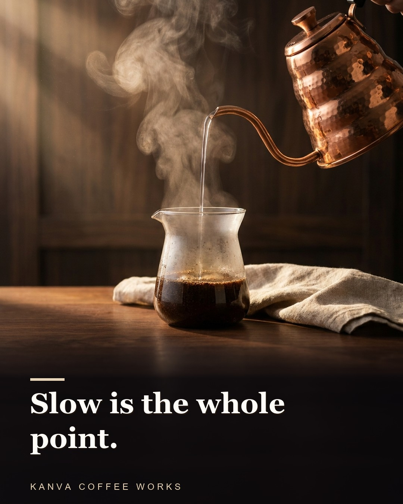
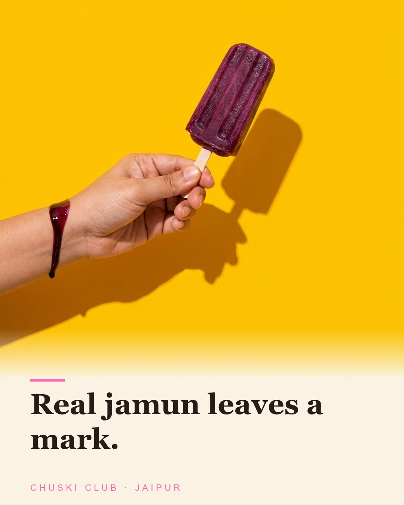
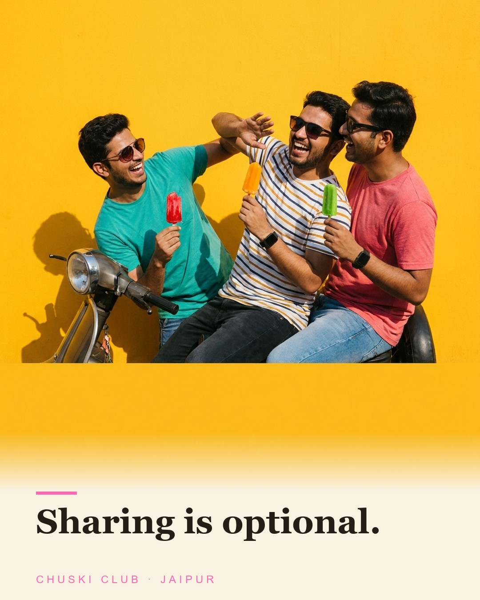
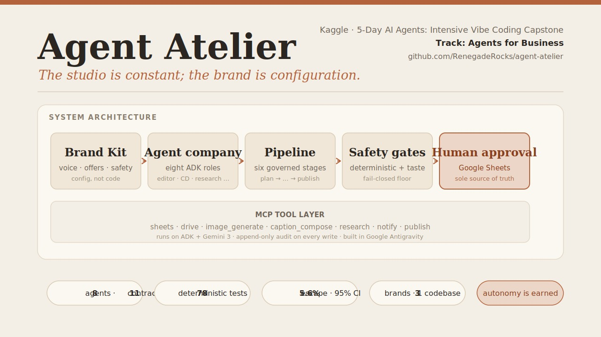

# Agent Atelier

**Give your brand info once- 8 ADK agents create weekly Instagram content automatically. High quality, with AI-Slop gates firmly in place.**

[](https://github.com/RenegadeRocks/agent-atelier/actions)

Tell it about your company in a guided interview. It plans your week, writes your
posts, designs your images in your brand's own type system — and its own Creative
Director rejects the weak work before you ever see it. **Nothing publishes without
a human's click**, and autonomy isn't assumed: the system *earns* trust on a
visible ladder, one approved piece at a time.

Three fictional brands run on this exact, unchanged code — a wellness center, a
coffee roastery, and an ice-pop shop — each with its own voice, palette,
brandmark, and safety rules, all of it configuration:

| Art of Living Ludhiana — calm | Kanva Coffee Works — premium |
|---|---|
|  |  |

| Chuski Club Jaipur — youthful | Chuski Club Jaipur — playful |
|---|---|
|  |  |

*Same engine. Zero code changes between brands — one brand is solemn, one is
royal, one is a gang of friends on a scooter, and the only difference between
them is a YAML file.*

---

## Architecture



*Brand Kit (configuration) → an eight-agent studio → a governed pipeline with a deterministic safety floor and a Creative-Director taste gate → a human approval queue backed by Google Sheets. The studio is constant; the brand is configuration.*

## What it does

- **Brand onboarding by interview** — a Strategist agent ingests your brand's
  story, drafts the profile, and explicitly asks you the safety rules (what may
  never be claimed or disclosed — never guessed from marketing copy), probes a
  violation on purpose, then saves a schema-validated `brand_kit.yaml`. Invalid
  kits are quarantined, never activated.
- **An eight-agent studio** — Managing Editor (orchestrates), content writers,
  Research & Verification, a deterministic ledger-linter, the Creative Director
  (two review gates plus a post-render pass with a capped revise loop and real
  escalation), Visual Production (text-free images through an OCR gate,
  composited with the brand's serif type system), Publishing & Ops.
- **A deterministic safety floor** — fail-closed checks on forbidden claims,
  non-disclosure rules, required framings, CTA bans, and claim grounding, with
  zero LLM calls in any gate; a semantic referee sits above it and fails closed
  in auto mode. A run-level circuit breaker stops runaways.
- **The Studio Floor console** — a live operator view (agent floor, activity
  feed, Needs-You tray, trust ladder). Approve / Request changes / Reject are
  real actions: every click maps 1:1 to a human-only spreadsheet column and an
  append-only audit trail. The orchestrator alone writes status; the console
  can *structurally* never lie about it.
- **A human-gated publish path** — approvals re-run the safety gauntlet, then a
  Post Kit (assets, caption, per-slide alt text, checklist) is exported for
  manual posting. Instagram auto-publish is deliberately absent at launch.
- **A learning loop** — an independent post-publication audit re-judges shipped
  pieces (measured escape rate: **5.6% on 18 pieces, 95% CI [1.0%, 25.8%]**)
  and a monthly retro mines the owner's edits into concrete canon amendments.

## Run it

See **[HANDOFF.md](HANDOFF.md)** — the whole system is five commands:

```bash
python onboard_brand.py demo/brand-packs/chuski-club/   # 1. intake interview
python -m app.scheduler --as-of 2026-07-06              # 2. plan the week
# 3. produce a piece (live pipeline)
python tools/export_floor_state.py && python tools/floor_serve.py   # 4. console → http://127.0.0.1:8787
python -m app.approval_poller                           # 5. honor the human's decision
```

No API keys? You can still run the full deterministic test suite
(`python -m pytest app/tests -m "not live"`, 78 tests) and tour the console on
demo data by double-clicking `ui/studio-floor/index.html`.

## How it was built (and why the history is the point)

This system was built **by AI coding agents, under supervision, in eleven gated
contracts** derived from a ~2,800-line PRD — each contract closed only by an
independent fresh-session validator plus green CI verified from raw evidence.
The agents mocked deliverables, claimed false greens, hallucinated a file save,
and once forged the evidence format itself. **Every incident was caught by a
gate or the owner's eye, fixed, and logged publicly:**

- [`specs/deviation_log.md`](specs/deviation_log.md) — the honest build record.
- [`app/tests/evidence/`](app/tests/evidence/) — one validation verdict table
  per contract, plus the escape-rate audit and the monthly retro.
- [`specs/PRD-Agentic-Content-Studio.md`](specs/PRD-Agentic-Content-Studio.md)
  — the source of truth (§19.1 defines the eleven contracts).
- `.agents/` + `build-view/` + `tools/build_view_split.py` — the build harness
  that drove it (progressive disclosure of the PRD, one contract at a time).

## Repo map

| Path | What it is |
|---|---|
| `app/` | The product: pipeline, agents, scheduler, policy server, breaker, approval protocol/poller, Post Kit, audit & retro tools |
| `app/tools/` | MCP-style tool servers (sheets, image gen, compositor with OCR gate, publish) |
| `ui/studio-floor/` | The operator console (self-contained; no build step) |
| `brands/` | Brand Kits — each company is one YAML file |
| `demo/brand-packs/` | Intake source material for the demo brands |
| `specs/` | PRD, agent instructions, canon, policies, schemas, golden set, deviation log |
| `HANDOFF.md` | Quickstart + architecture + known-and-bounded gaps |

## Status & roadmap

Feature-complete against the PRD (all eleven contracts validated). Sequenced
next, per the PRD — not yet built, and never presented otherwise: a graphical
Brand Desk for intake (today it's the terminal interview), live event streaming
for the console (today it's an honest snapshot), and Instagram auto-publish
(gated behind the trust ladder, off by design).

*Built as the capstone for Kaggle's five-day Vibe Coding (Agents) course.
All demo brands are fictional.*
